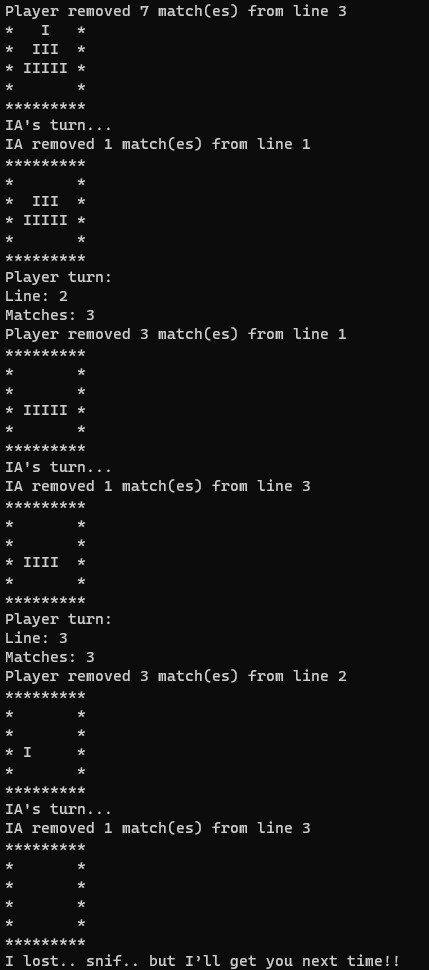
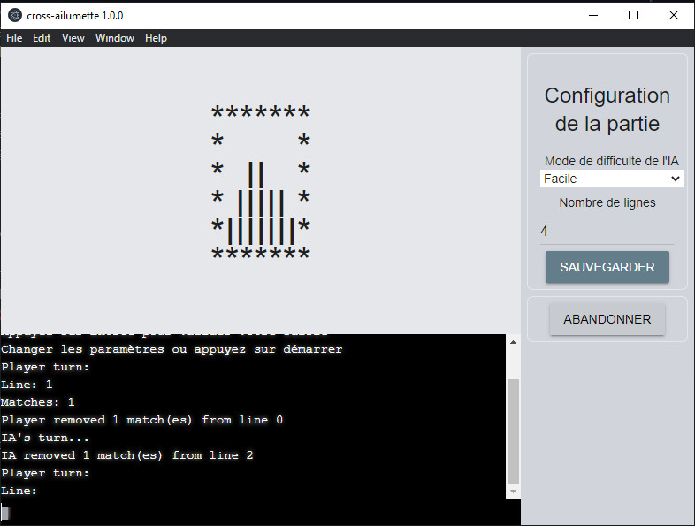

# Cross Ailumette

```js
*********
*   I   *
*  III  *
* IIIII *
*IIIIIII*
*********
Player turn:
```

A Matches game build with Electron and VanillaJS for GUI and node for CLI.

## :green_book: Requirements

---

You need to have some elements for using this program on you computer:

- NodeJS 12 or later

## :building_construction: Building and Launching

---

You need to install npm packages before using this program:

>```npm install```

After you installed them, you can now use the program with the following command:

> ```node ailumette```

This gonna launch the program with basic configuration

For launching the GUI app, you need to add *--gui* flag

> ```node ailumette --gui```

The following parameters can be set for creating custom experience:

|Flag|Alias|Description|Values|Default|
|:--:|:------:|-------------------------|------------------------------------------|:------:|
| -i | -ia    | Set the IA difficulty   | easy, intermediate, hard, auto or manual | easy   |
| -l | -lines | Set the number of lines | Any numbers from 1 to infinity and beyond| 4      |

### :warning: If you launch the GUI app, you need to set settings in it, it doesn't take command line arguments

## :camera: Screenshots

---

Here are some screenshots from the app

### CLI

---



### GUI

---



## :8ball: BONUS

---

The next elements is considered as bonus in this project:

- Three levels of difficulty for the AI
- Board with custom line counts
- Manual mode (Two player can play the game)
- Auto mode (Two IA plays for you, perfect no ?)
- Abort game in GUI mode
- Set settings at runtime in GUI mode
- Not killing app after game in GUI mode

## :black_nib: PS

---

If you have some comments or constructive critics to make on the program or the code, feel free to leave them in issues, I'm gonna be pretty happy to read them and maybe update the project with some recommandations

And Finally, Enjoy!
